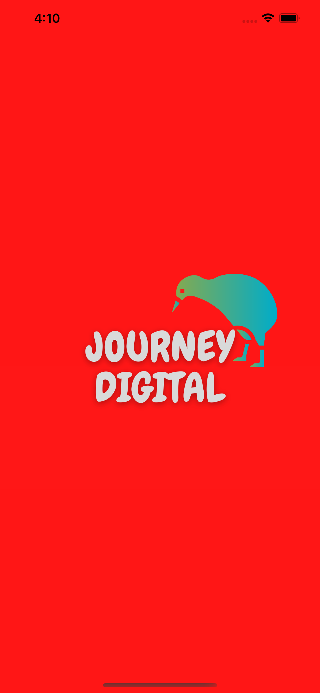
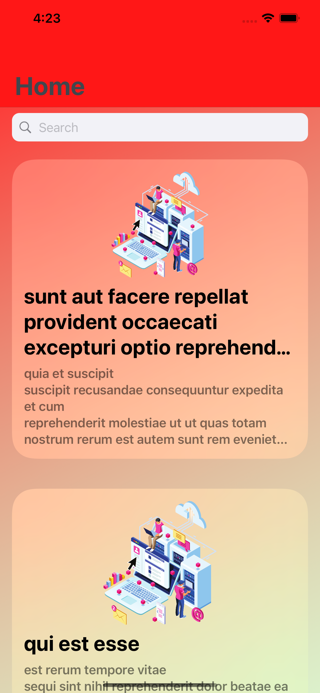
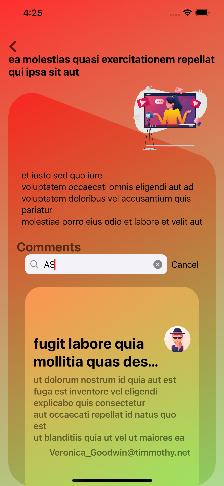
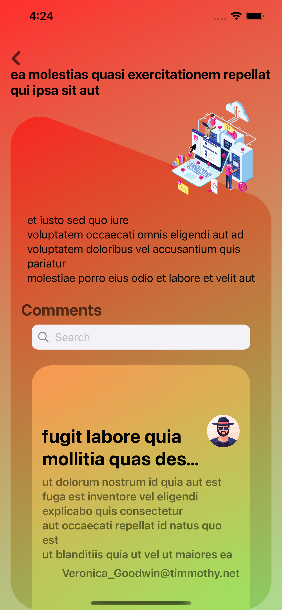

# JOURNEY DIGITAL

###  SwiftUI (iOS App Mobile Application)

 #### This mobile app is developed for `Journey-digital` coding exam. it could be navigated between the home screen and details view. There is a search component inside of each screen for search list of post and comments. 
  
 #### The mobile application has been using two different endpoints to get the data from the backend.
   - https://jsonplaceholder.typicode.com/posts - `get post list`
  - https://jsonplaceholder.typicode.com/comments?postId={postId} `get comment list`
  - 
 For home screen could show the Post list and next show the Details with all the comments which are related to the post.


 #### For this module has been added a package dependency using swift packages
 - Open Xcode project, select File > Swift Packages > Add Package Dependency and enter its swiftUIX(0.0.7) repository URL
 
# Requirements
-  Xcode Version 12.4 
-  iOS verion 14.4


### SCREENS
 
 


##### Usage

Clone the repository:

```shell
git clone git@github.com:dushmantha/JOURNEY-D.git
```

>**Copyright &copy;  07/2021-present `@tdmihiran@gmail.com.`**
